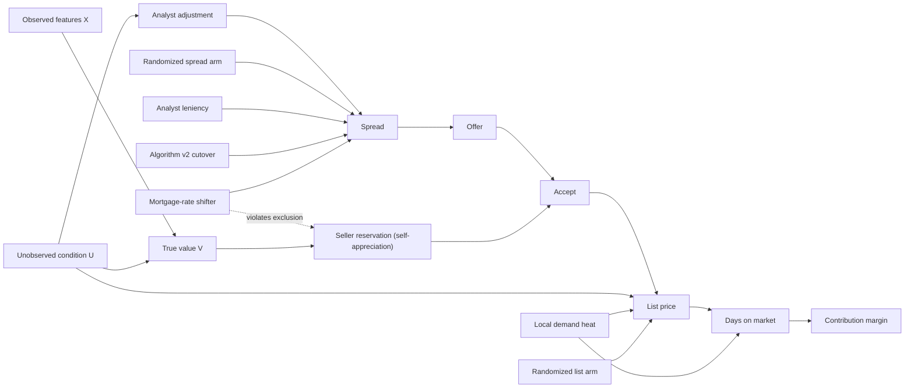

# iBuyer pricing: valuation, causal price effects, and margin optimization

A self-contained simulation lab for the question *"walk me through (1) the valuation model and (2) how you think about
the causal component"* in an iBuyer setting (Offerpad-style: instant cash offers to sellers, resale to buyers).

The simulator plants a **known** causal structure — unobserved home condition, analyst discretion, seller
self-appreciation, adverse selection, local demand shocks — so every estimator and every pricing decision can be scored
against the truth.

| What you get | Where |
|---|---|
| OVM-style valuation model with prediction intervals | `offerpad_simulator/valuation.py` |
| Funnel simulator with ground truth (offers → acceptance → resale) | `offerpad_simulator/simulate.py`, `offerpad_simulator/config.py` |
| Naive vs DML vs IV (experiment, analyst leniency, rollout RD, an *invalid* IV) vs control function; HTE | `offerpad_simulator/causal.py` |
| Seller self-appreciation & adverse selection | `offerpad_simulator/seller_psych.py` |
| Margin optimization: spread, list price, 3% worked example, volume constraint, uncertainty | `offerpad_simulator/optimize.py` |
| Figures + auto-generated report | `outputs/figures/`, `outputs/results.md` |
| Theory write-up and interview answer script | `docs/THEORY.md`, `docs/INTERVIEW_GUIDE.md` |
| Interactive walkthrough | `notebooks/walkthrough.ipynb` |

## Quickstart

```bash
python -m venv .venv && source .venv/bin/activate
pip install -r requirements.txt
python run_all.py            # ~1 min: simulate, estimate, optimize, write outputs/results.md + figures
python run_all.py --quick    # smaller sample
pytest -q                    # checks that causal estimators recover the planted truth
```

## The causal structure being simulated



## Headline results (seed 7, 60k offers)

Portfolio at current policy: acceptance 23%, gross margin 8.0%, contribution margin 3.6%, median DOM 35 days.

**Effect of +1pp spread on offer acceptance (pp)** — truth **−3.04**

| Naive OLS | DML (X only) | 2SLS: randomized arm | 2SLS: analyst leniency | 2SLS: v2 rollout | 2SLS: mortgage rate (invalid) | Control-function logit |
|---|---|---|---|---|---|---|
| −0.27 | −0.86 | **−3.01** | −2.74 | −1.92 ± 1.18 | +3.38 (flagged by over-ID test, p = 0.004) | −2.82 |

**Pricing decisions** (optimum chosen by each model, scored on the truth)

| | truth | causal model | naive model |
|---|---|---|---|
| Spread change vs current | +3.0pp | +3.0pp | +6pp (grid edge) — loses 8% of contribution |
| List-price multiplier | 1.025 | 1.015 | 1.08 (grid edge) — loses 26% per home |

**3% list-price cut** (per bought home, truth): P(sold ≤ 60d) 72% → 84%, E[DOM] 53 → 37 days,
contribution −$3.4k. The causal model predicts +12.5pp and −$3.3k; the naive model predicts no change in speed.

**Self-appreciation:** sellers' stated value = OVM × (1 + 2.9% + 0.62 × trailing market HPA); accepted homes were
over-valued by the OVM by 2.6% on average (adverse selection).


Full tables and every figure: [`outputs/results.md`](outputs/results.md).

## Experiments to try

Edit `offerpad_simulator/config.py` (or pass a `SimConfig(...)`) and re-run:

* `analyst_soft_info=0` — remove the confounding path; the naive estimate converges to the truth.
* `rate_on_reservation=0` — the mortgage-rate instrument becomes valid.
* `self_apprec_hpa_passthrough=1.0` — hotter markets convert even less; watch acceptance by market.
* `beta_condition=0.06` — more private information → stronger adverse selection → wider optimal spread.
* `holding_cost_per_day=0.0004` — costlier inventory → the optimal list price falls (1.025 → 1.01) and the cost of a 3% cut shrinks (−$3.4k → −$2.5k).
* `experiment_share=0.05` — a smaller test: see how much the IV confidence interval widens.

## Notes

* All data are synthetic. Parameters are chosen to be plausible, not to describe any company's actual numbers.
* Randomized price tests are treated as available at modest scale; the code shows what each quasi-experimental
  alternative buys you when they are not.
