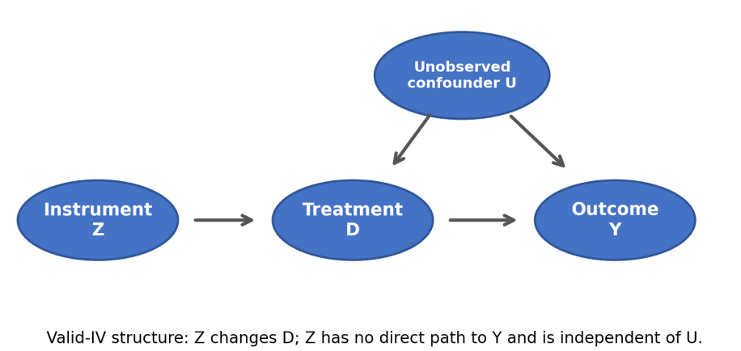
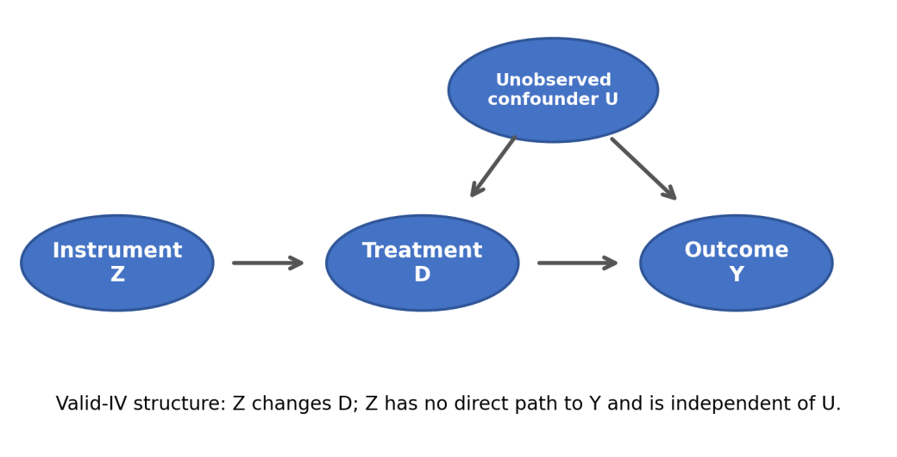
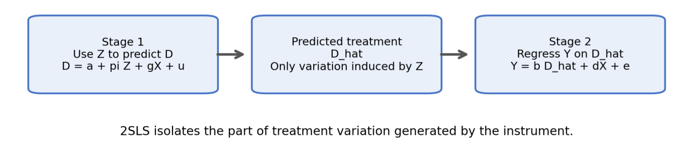
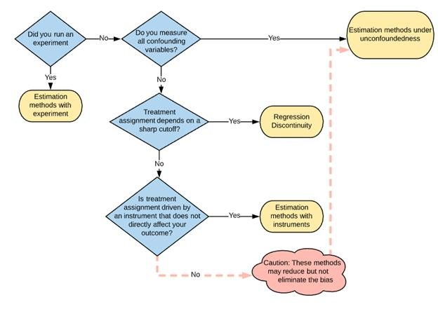
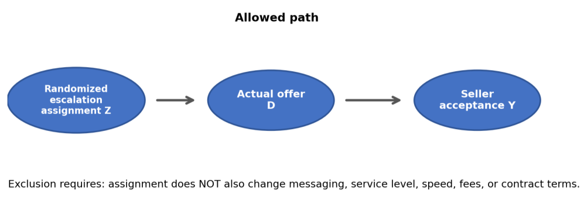
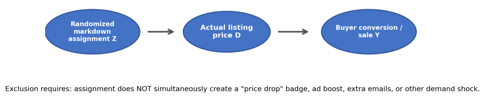
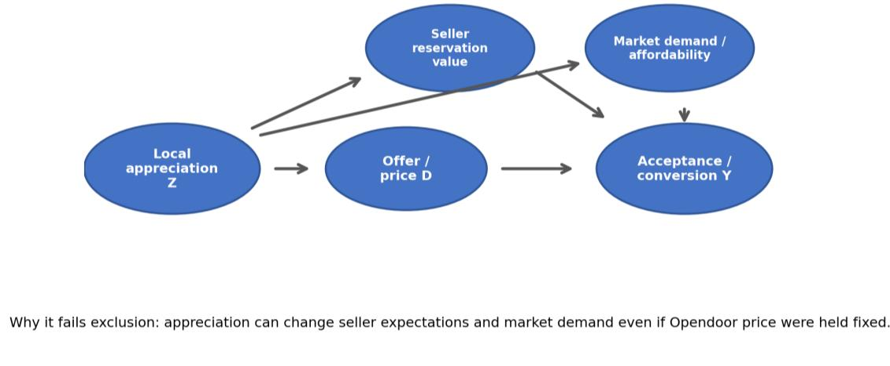

# Instrumental variables for pricing causal inference

**Author:** Jane Huang  
**Source date:** 09/21/2026  
**Source:** [Instrumental_Variables_for_Pricing.pdf](Instrumental_Variables_for_Pricing.pdf)

This edited Markdown companion preserves the supplied 13-page PDF's fifteen
technical sections, tables, examples, references, and seven embedded figures.
Personal anecdotes and nontechnical framing are omitted. Paragraph and table
wrapping is restored; printed page numbers and table-of-contents leaders are
omitted. Equations are typeset in Markdown. The original PDF is unchanged.
This companion, its extracted figures, and the source PDF are tracked in this
repository; they are not inputs to the public report builder.

Source PDF SHA-256:
`ac8d58e48fad5ccba75231404a7cb5d00198a6aae257278c2b60c088d5112dd2`.

## Repository audit notes

These notes distinguish the source primer's technical content from the current
implementation. The numbered sections retain its illustrative models and
examples; the editorial changes described above do not change their scope.

- **Scope:** this is a conceptual pricing-IV primer, not generated results or
  evidence of an actual company's practices. Threshold/RD designs, causal
  forests, and structural demand models discussed here are not implemented
  features of this lab.
- **Acquisition economics:** section 11.2 uses acceptance times an illustrative
  margin. The implemented linked policy instead learns completed-acquisition-
  weighted lifecycle rewards on all eligible prospects, including
  nonacquirers. Acceptance is not closing, and the selected inventory's margin
  can depend on the offer.
- **Resale economics:** section 11.1 is explicitly a one-horizon simplification.
  It is not this repository's accounting formula: the code includes terminal
  proceeds for unsold inventory, charges acquisition basis once in every
  disposition state, and subtracts selling and carrying costs. The terminal
  sale is 45 days after the repricing decision, not after initial listing.
- **Estimands:** the classic complier LATE interpretation in sections 4 and 7
  needs binary treatment as well as a binary instrument and the stated
  assumptions. Continuous-price IV generally has a different, local weighted
  interpretation; one slope does not identify the full dose-response curve.
  The percentage-point example in section 11 is illustrative, not a fitted
  result from this repository.
- **Exclusion:** a marketing change triggered directly by assignment, even
  with delivered price held fixed, is an additional instrument-to-outcome
  pathway. A badge or other response caused only by the delivered price is
  instead a mediator of that price intervention; whether to include it
  depends on the treatment definition. The blanket warning in section 10.2
  should be read with that distinction.
- **Diagnostics:** the lab reports `linearmodels` robust first-stage statistics
  with their `chi2(1)` reference distribution, not as ordinary F statistics.
  Its separate linked experiment randomizes fully delivered actions and
  needs no IV.

Use the [technical summary](design_implementation_summary.md),
[data dictionary](data_dictionary.md), and
[reference results](reference_results.md) for maintained implementation
contracts and fitted numbers. External references below are retained from the
PDF; this adaptation is not a fresh literature or commercial-terms review.

## Contents

1. [Executive overview](#1-executive-overview)
2. [What an instrumental variable is](#2-what-an-instrumental-variable-is)
3. [Correcting a common misconception about IV](#3-correcting-a-common-misconception-about-iv)
4. [The IV assumptions, one by one](#4-the-iv-assumptions-one-by-one)
5. [Why IV works: intuition and DAGs](#5-why-iv-works-intuition-and-dags)
6. [Estimation: Wald estimator and 2SLS](#6-estimation-wald-estimator-and-2sls)
7. [LATE, compliers, and what IV actually identifies](#7-late-compliers-and-what-iv-actually-identifies)
8. [Weak instruments and first-stage diagnostics](#8-weak-instruments-and-first-stage-diagnostics)
9. [IV versus alternative causal designs](#9-iv-versus-alternative-causal-designs)
10. [Opendoor-style IV candidate library](#10-opendoor-style-iv-candidate-library)
11. [From causal price elasticity to pricing optimization](#11-from-causal-price-elasticity-to-pricing-optimization)
12. [Heterogeneity, nonlinear effects, and multiple price doses](#12-heterogeneity-nonlinear-effects-and-multiple-price-doses)
13. [Diagnostics, falsification, and robustness checks](#13-diagnostics-falsification-and-robustness-checks)
14. [Common IV failure modes](#14-common-iv-failure-modes)
15. [Glossary and references](#15-glossary-and-references)

## 1. Executive overview

Suppose we want the causal effect of a treatment D on an outcome Y, but D is
confounded. For pricing, D might be an offer price or a listing-price markdown,
while Y might be seller acceptance or buyer conversion. A valid instrument Z
provides a source of treatment variation that is not contaminated by the
confounding that makes ordinary regression unreliable.

Notation used throughout: Z = instrument; D = treatment whose causal effect
we want; Y = outcome; X = observed pre-treatment covariates; U = unobserved
confounder(s); epsilon ($\varepsilon$) = unobserved component of the outcome
equation; u = first-stage error term.

| Question | What to ask | Pricing translation |
|---|---|---|
| Relevance | Does Z actually move D? | Does assignment or policy materially change offer/list price? |
| Independence / exogeneity | Is Z independent of unobserved determinants of Y, possibly conditional on X? | Is assignment as-good-as-random rather than targeted to hard homes/sellers? |
| Exclusion restriction | Can Z affect Y through any path other than D? | Does assignment alter messaging, exposure, service, timing, fees, or financing besides price? |
| Monotonicity (for LATE) | Does Z move treatment in one direction for everyone, with no systematic defiers? | Does an escalation assignment never cause some sellers to receive a lower offer while raising others? |

## 2. What an instrumental variable is

In observational data, treatment is often selected rather than randomly
assigned. Price is a classic example: teams lower prices when demand is weak,
raise offers when seller acceptance looks unlikely, or change terms in response
to home quality and market conditions. Those same factors also affect the
outcome, creating endogeneity.

An instrumental variable is a variable Z used to isolate variation in
treatment D that can be treated as externally generated. The causal chain we
want is:

```text
Instrument Z -> Treatment D -> Outcome Y
```

The instrument itself is not the treatment of scientific interest. It is a
lever that nudges treatment. We then use only the treatment variation caused
by that lever to estimate the causal effect of treatment on outcome.



Core intuition: use exogenous variation in Z to isolate causal variation in
treatment D.

## 3. Correcting a common misconception about IV

A valid instrument should be independent of the unobserved confounders that
jointly affect D and Y. If Z is randomly assigned, or conditionally
as-good-as-random, it should not share a common cause with Y that bypasses D.
Thus the reduced-form effect of Z on Y is useful causal signal: it is the
outcome response generated by the treatment change induced by Z.

| Statement | Correct? | Why |
|---|---|---|
| "Z must be correlated with Y." | Not required as a definition | A strong enough causal effect plus relevance will often create a reduced-form association, but sampling noise can make it small. |
| "Z is correlated with Y because of a confounder." | No, for a valid IV | That would generally violate independence/exogeneity. |
| "Z causally changes D." | Yes | This is relevance in causal form. |
| "Z affects Y only through D." | Yes | This is the exclusion restriction. |
| "Z must literally be randomized." | No | True randomization is ideal, but natural or rule-based quasi-random variation can sometimes justify exogeneity. |

## 4. The IV assumptions, one by one

### 4.1 Relevance

Relevance means the instrument changes or predicts treatment after accounting
for included covariates. In a linear first stage:

$$
D = \alpha + \pi Z + \gamma'X + u,\qquad \pi \ne 0.
$$

Notation: D = treatment; alpha ($\alpha$) = intercept; pi ($\pi$) = first-stage
effect/coefficient of the instrument; Z = instrument; X = vector of observed
exogenous controls; gamma ($\gamma$) = coefficient vector for X; $\gamma'X$ =
the linear contribution of those controls; u = first-stage error term;
$\pi \ne 0$ means the instrument moves treatment.

In pricing, a randomized escalation policy is relevant if assignment
materially changes the actual offer. A markdown-assignment experiment is
relevant if assignment materially changes realized listing price.

### 4.2 Independence / exogeneity

The instrument must be unrelated to unobserved determinants of the outcome,
at least after conditioning on justified covariates. In shorthand,
$\operatorname{Cov}(Z,\varepsilon)=0$. Randomization is the cleanest route,
but quasi-random assignment, lotteries, thresholds, queues, or operational
rules can sometimes provide credible variation.

A common failure is targeted assignment. If difficult-to-convert listings are
intentionally sent to a special pricing policy, that policy indicator is not
automatically a valid instrument because it is correlated with latent demand.

### 4.3 Exclusion restriction

Exclusion says Z affects Y only by changing D. It rules out direct effects and
alternative mediating channels. A useful thought experiment is: if I could
magically hold treatment fixed, would changing Z still change the outcome?
If yes, exclusion is questionable.

| Candidate Z | Hold price fixed: could Y still change? | Exclusion assessment |
|---|---|---|
| Random markdown assignment with no other operational changes | Probably not | Plausible |
| Local home-price appreciation | Yes: seller expectations and market demand can change | Poor |
| Mortgage rates | Yes: buyer affordability changes | Poor |
| Analyst identity | Yes: service, timing, judgment, negotiation can differ | High risk |
| Sharp pricing threshold | Potentially no, if nothing else changes at the cutoff | Potentially credible / RD-style |

### 4.4 Monotonicity and LATE

For the classic binary-instrument LATE interpretation, monotonicity means
assignment does not push treatment in opposite directions for different
people. If Z is an encouragement to raise offers, there should not be a
meaningful subgroup whose offer systematically falls because of the
encouragement. Under relevance, independence, exclusion, and monotonicity,
IV identifies the Local Average Treatment Effect for compliers: the units
whose treatment is actually changed by Z.

### 4.5 SUTVA (Stable Unit Treatment Value Assumption) / interference considerations

Standard IV reasoning also relies on stable treatment definitions and limited
interference across units. In housing, interference can matter: markdowns on
nearby homes may change comparable-sale expectations or buyer traffic for
other listings. If one listing's assignment affects another listing's outcome,
the estimand and design need extra care.

## 5. Why IV works: intuition and DAGs



Figure: valid IV structure with an unobserved confounder U of treatment and
outcome.

Ordinary regression of Y on D mixes two sources of treatment variation:
(1) variation caused by confounders U and (2) externally generated variation
caused by Z. IV tries to keep only source (2). Because Z is independent of U
and has no path to Y except through D, the Z-induced component of D behaves
like quasi-random treatment variation.

**Mental model**

OLS asks: "When price differs, how does outcome differ?"

IV asks: "When price differs specifically because the instrument moved it,
how does outcome differ?"

## 6. Estimation: Wald estimator and 2SLS

### 6.1 Binary instrument: Wald estimator

With a binary instrument Z and a scalar treatment D, a simple IV estimand is:

$$
\text{IV effect} =
\frac{E(Y\mid Z=1)-E(Y\mid Z=0)}
     {E(D\mid Z=1)-E(D\mid Z=0)}.
$$

Notation: $E(\cdot)$ = expectation/average; Y = outcome; D = treatment;
Z = binary instrument; Z=1 = assigned/encouraged group; Z=0 = control group.
The numerator is the reduced-form effect of Z on Y; the denominator is the
first-stage effect of Z on D; their ratio is the IV/Wald estimand under the
IV assumptions.

The numerator is the reduced-form effect of assignment on the outcome.
The denominator is the first-stage effect of assignment on treatment.
Dividing tells us how much outcome changes per unit of instrument-induced
treatment change.

### 6.2 Two-stage least squares (2SLS)



- Stage 1: predict treatment using the instrument and justified controls.
  Save D_hat.
- Stage 2: regress outcome on D_hat and the same justified controls.
- Use IV/2SLS software for inference rather than manually running two OLS
  regressions, because standard errors must account for the generated
  regressor and design.

For nonlinear binary outcomes, a linear probability 2SLS model is often used
for a transparent local effect, but more specialized IV estimators may be
appropriate depending on the estimand, treatment, and outcome. Do not casually
run a first-stage logistic regression and plug predictions into a second-stage
logistic regression and call it standard 2SLS.

## 7. LATE, compliers, and what IV actually identifies

IV frequently does not identify the average treatment effect for every
listing or seller. With a binary instrument and heterogeneous treatment
effects, the classic result is a Local Average Treatment Effect (LATE)
among compliers.

| Type | Behavior when Z switches 0 -> 1 | Role |
|---|---|---|
| Complier | Takes the treatment because of the instrument | IV identifies the effect for this group under assumptions |
| Always-taker | Treated regardless of Z | Does not contribute to first-stage contrast |
| Never-taker | Untreated regardless of Z | Does not contribute to first-stage contrast |
| Defier | Moves opposite to the encouragement | Monotonicity rules out systematic defiers |

Pricing translation: if markdown assignment only changes actual price for a
subset of listings because humans can override it, the estimated effect
pertains to listings whose price is changed by the assignment. That group may
differ from all listings, so external validity must be discussed explicitly.

## 8. Weak instruments and first-stage diagnostics

A weak instrument barely moves treatment. Weak IV can produce unstable
estimates, large finite-sample bias, and misleading inference. The classic
first-stage F-statistic is a screening diagnostic in simple linear settings,
but the old "F > 10" rule is only a rough heuristic and can be inadequate with
multiple instruments, heteroskedasticity, clustering, or weak-identification
concerns.

| Diagnostic | What it tells you | What it does NOT tell you |
|---|---|---|
| First-stage coefficient | Direction and size of Z -> D | Whether exclusion is valid |
| First-stage F / weak-IV statistics | How much identifying strength Z provides | Whether Z is exogenous |
| Balance tests under randomization | Whether observed covariates look balanced | Whether unobserved balance or exclusion is proven |
| Reduced form Z -> Y | Whether assignment changes the outcome | Which causal channel produced the change |
| Overidentification tests with multiple IVs | Whether instruments are mutually compatible with restrictions under model assumptions | A definitive proof that every instrument is valid |

## 9. IV versus alternative causal designs

RCT is the traditional gold standard that enables unbiased estimation of
treatment effects. However, in observational studies, the possibility of bias
arises because a difference in the treatment outcome may be caused by a factor
that predicts treatment rather than the treatment itself, known as
confoundedness. As a result, it's desirable to replicate a randomized
experiment as closely as possible through various strategies. In general,
causal inference consists of a family of statistical methods including
estimation methods under unconfoundedness (also known as conditioning-based
methods), and estimation methods for quasi-experiments (a research design that
looks like an experimental design but lacks the key ingredient -- random
assignment of the treatment -- studying instead pre-existing groups that
received different treatments after the fact). In quasi-experiments, commonly
used approaches include simple natural experiments, instrumental-variables
(IV), and regression-discontinuity models. The following shows high-level
workflow recommendations for causal algorithm selection for an observational
study with one snapshot of the outcome.

A few example methods are listed below. These methods are complementary
rather than mutually exclusive. For example, a randomized encouragement
design can be analyzed using instrumental variables (IV), since assignment
is randomized while treatment compliance may be imperfect. This is not
intended to be a comprehensive list, but rather a set of illustrative examples.

| Method | Main identification idea | Best fit | Main weakness in pricing |
|---|---|---|---|
| Randomized controlled trial | Randomize treatment D itself | You can directly randomize offer/list price or policy | Operational, legal, fairness, or revenue constraints |
| Instrumental variables | Randomize or quasi-randomize Z that shifts endogenous D | Treatment cannot be cleanly randomized but an external lever exists | Exclusion and exogeneity are hard to defend; often local effect |
| Difference-in-differences | Compare treated vs control changes around a policy | Market/policy rollout with credible parallel trends | Parallel trends can fail; concurrent shocks |
| Regression discontinuity | Exploit a treatment jump at a cutoff | Sharp/fuzzy pricing or eligibility threshold | Usually local to cutoff; manipulation or co-jumps can invalidate |
| Structural demand/pricing model | Specify economic behavior and estimate primitives | Optimization, counterfactual pricing, policy simulation | More modeling assumptions; misspecification risk |



The list is illustrative rather than exhaustive; the assignment mechanism
and target estimand determine which assumptions must be justified.

## 10. Opendoor-style IV candidate library

The following hypothetical designs illustrate how to reason about IV validity.
They do not imply these mechanisms exist in production.

| Candidate instrument | Side | Treatment D | Outcome Y | Relevance | Exclusion risk | Design assessment |
|---|---|---|---|---|---|---|
| Randomized offer-escalation assignment | Buy side | Actual offer | Seller acceptance | Strong by design | Low if only offer changes | Preferred hypothetical IV |
| Randomized markdown assignment | Sell side | Actual list price | Buyer conversion / sale | Strong by design | Low if exposure and terms unchanged | Preferred hypothetical IV |
| Randomized pricing recommendation shown to human | Either | Implemented price | Acceptance / conversion | Depends on compliance | Low only if recommendation affects nothing else | Good encouragement design |
| Queue-based random reviewer assignment | Buy side | Offer / adjustment | Acceptance | May move price | Reviewer may change service/timing | Risky without operational isolation |
| Analyst / pricer identity | Either | Price | Conversion | May be strong | High: judgment, negotiation, timing | Usually risky |
| Recent local appreciation | Either | Price / valuation | Acceptance / conversion | Often strong | High: seller beliefs, outside option, demand | Invalid teaching example |
| Mortgage-rate movement | Sell side | Price / markdown | Buyer conversion | Can be strong | High: affordability directly changes | Usually poor |
| Weather shock | Sell side | Price response | Tours / conversion | May move pricing | Directly changes search/tours | Poor |
| Automated pricing threshold | Sell side | Markdown | Conversion | Potentially sharp | Credible if only treatment jumps | Consider fuzzy RD |
| Eligibility threshold for escalation | Buy side | Offer escalation | Acceptance | Potentially sharp | Credible if no other policy changes at cutoff | Consider fuzzy RD |
| Model version rollout by time | Either | Price | Conversion | Can move price | Time trends and simultaneous launches | Risky; maybe DiD/event study |
| Geographic rollout of new pricing policy | Either | Price | Conversion | Can move price | Markets differ; local shocks | Often DiD, not automatically IV |
| System outage affecting recommendation adoption | Either | Implemented price | Conversion | May create compliance shock | Outage may affect latency/service too | Potential natural experiment, high scrutiny |
| Randomized seller email reminder | Buy side | Negotiation / action | Acceptance | Could affect engagement | Directly affects acceptance | Not an IV for price; treatment itself may be messaging |
| Randomized ad boost | Sell side | Traffic / exposure | Conversion | Strong for exposure | Directly changes conversion through exposure | Could instrument exposure, not price |
| Randomized financing incentive | Sell side | Effective monthly cost | Conversion | Strong | May change product attractiveness directly | Define treatment carefully; exclusion depends on estimand |

### 10.1 Preferred buy-side example: randomized escalation



Suppose eligible seller leads are randomly assigned to an escalation policy.
Assignment changes the probability or amount of offer increase, but
seller-facing messaging, SLA, inspection policy, fees, and closing terms are
held constant. Assignment is then a credible instrument for actual offer
amount. If humans can override the recommendation, IV naturally handles
noncompliance and estimates a local effect for cases whose offer is changed
by assignment.

### 10.2 Preferred sell-side example: randomized markdown assignment



The design is clean only if the random assignment alters price and does not
simultaneously alter marketing treatment. A "price reduced" badge, email
campaign, search-ranking boost, open-house intensity, or agent follow-up
would create additional paths from Z to Y and violate exclusion for the causal
effect of price.

### 10.3 Why recent local appreciation is a bad IV



Recent local appreciation has multiple plausible paths to the outcome besides
Opendoor price.

Recent local home-price appreciation means the percentage increase in
comparable local home values over a recent window such as 3, 6, or 12 months.
It may strongly predict an algorithmic valuation or offer. But it can also
increase a seller's reservation value, change expectations about waiting to
sell, and alter buyer demand. Therefore it can be highly relevant and still
fail exclusion.

### 10.4 Mortgage rates

Mortgage rates can move prices, markdown decisions, and market conditions, so
relevance may be substantial. But they also directly change buyer
affordability and monthly payment. On the seller side, rates can affect the
attractiveness of moving and obtaining a replacement mortgage. Thus holding
price fixed does not hold the outcome fixed when rates change: a classic
exclusion concern.

### 10.5 Analyst or pricer identity

Analyst identity sometimes looks attractive because different analysts may
systematically recommend different prices. The problem is that identity can
also alter response time, negotiation style, escalation behavior, comp
selection, exception handling, communication quality, or case mix. Random
assignment plus strict workflow standardization would improve the design,
but identity is not automatically a valid instrument merely because
assignment looks operational.

### 10.6 Pricing thresholds and fuzzy RD

Suppose a score of 0.500 triggers a recommended 3% markdown while 0.499 does
not. Listings just around the threshold may be comparable. If actual markdown
compliance is imperfect, threshold crossing can serve as an instrument for
treatment in a fuzzy regression-discontinuity design. The exclusion logic
becomes: nothing else important should jump at the same threshold, and units
should not precisely manipulate the running variable around the cutoff.

## 11. From causal price elasticity to pricing optimization

We often care less about the causal coefficient itself than about how it
enters a pricing decision. The key distinction is prediction versus
intervention. A predictive model estimates $P(Y=1\mid \text{price},X)$.
A causal pricing model needs $P(Y=1\mid do(\text{price}),X)$, or a defensible
approximation to how conversion would change if we actively changed price.

### 11.1 Sell-side objective

**Illustrative one-horizon objective**

$$
\text{Expected contribution}(p)
=q(p)[p-\text{basis}-\text{variable cost}]
-[1-q(p)]\,\text{expected non-sale cost}.
$$

Here q(p) is the causal probability of sale within a decision horizon at
price p. The non-sale cost can represent expected carrying cost, future
markdown risk, financing cost, inventory capital, or an approximation to
continuation value. A production system would typically use a richer dynamic
objective rather than this one-period simplification.

If a local IV estimate implies that a 1% price reduction raises 30-day
conversion by about 2 percentage points near the current price, the optimizer
can compare the loss in per-sale margin against the gain in sale probability
and reduced inventory cost. The correct decision depends on basis, holding
cost, time-to-sale value, uncertainty, and whether the local slope remains
valid for the contemplated change.

### 11.2 Buy-side objective

**Illustrative buy-side objective**

$$
\text{Expected lead value}(O)
=a(O)[\text{expected resale net value}-O-\text{transaction costs}],
$$

where O is the offer and a(O) is causal seller acceptance probability.

| Offer | Illustrative acceptance | Margin if acquired | Expected lead value |
|---|---|---|---|
| $480k | 25% | $50k | $12.5k |
| $490k | 35% | $40k | $14.0k |
| $500k | 45% | $30k | $13.5k |

The highest offer is not automatically optimal: acceptance rises with offer,
but unit economics fall. Causal estimation matters because using a confounded
acceptance model can overstate or understate the incremental acceptance
generated by another $1,000 of offer.

### 11.3 Why IV alone may not be enough for global optimization

- A single binary instrument often gives one local slope or one LATE, not a
  full response curve.
- Optimization across a wide price range requires richer variation: multiple
  randomized price doses, continuous encouragement, repeated experiments,
  or a structural demand model.
- Effects can vary by home liquidity, market tightness, price band, seller
  urgency, season, days on market, and distance from comparable sales.
- Uncertainty should enter guardrails: constrain extrapolation outside
  support and shrink noisy segment-level effects.
- Long-run effects matter: a markdown can change days on market, future
  buyer beliefs, negotiation, and carrying cost, not just immediate conversion.

## 12. Heterogeneity, nonlinear effects, and multiple price doses

A practical pricing system should expect heterogeneous treatment effects.
A 1% markdown on a highly liquid starter home may have a smaller conversion
effect than the same percentage change on a stale, mispriced luxury listing.
Likewise, a $5,000 offer increase may matter more for a seller near an
acceptance threshold than for a seller whose outside option is far above
the offer.

| Approach | What it adds | Caution |
|---|---|---|
| Multiple randomized price arms | Estimates response at several price changes | Requires enough sample and business tolerance |
| Continuous randomized encouragement | Creates richer treatment variation | Need monotonic, interpretable encouragement mechanism |
| Interactions in 2SLS | Allows effects by observable segment | Weak first stages within segments can explode variance |
| Causal forests / heterogeneous IV methods | Flexible heterogeneity discovery | Interpretability and overlap; avoid data dredging |
| Structural demand model | Full counterfactual demand/optimization framework | Strong behavioral assumptions and calibration burden |

## 13. Diagnostics, falsification, and robustness checks

No statistical test can prove exclusion, because exclusion is fundamentally a
causal assumption about pathways. Good IV work therefore combines design
knowledge, institutional detail, falsification tests, and sensitivity analysis.

- First stage: report effect size, uncertainty, and weak-IV diagnostics, not
  just significance.
- Randomization/balance: verify instrument assignment is balanced on
  pre-treatment home, seller, market, and operational covariates.
- Pre-treatment outcomes: Z should not predict outcomes measured before
  assignment.
- Operational invariance: check that Z does not change response time, contact
  frequency, channel, agent seniority, marketing exposure, financing,
  inspection treatment, or fees unless those are part of D.
- Placebo thresholds or placebo dates: useful in RD or rollout designs.
- Density/manipulation checks near a threshold: look for sorting around
  the cutoff.
- Reduced form: report Z -> Y alongside first stage and IV estimate.
- Alternative windows/specifications: verify conclusions are not driven by
  one bandwidth, time window, or functional form.
- Clustered inference: account for geographic, temporal, seller, or
  listing-level dependence where relevant.
- Weak-IV robust inference: consider Anderson-Rubin or related procedures
  when identification may be weak.
- External validity: describe who the compliers are and where the instrument
  actually moves price.

## 14. Common IV failure modes

| Failure mode | Example | Why it biases IV |
|---|---|---|
| Direct effect of Z on Y | Markdown assignment also triggers marketing emails | Outcome changes through marketing as well as price |
| Z shares a cause with Y | Analysts assigned difficult cases | Assignment correlates with latent conversion difficulty |
| Bad control / post-treatment control | Control for a mediator affected by Z | Can block part of causal pathway or induce collider bias |
| Weak instrument | Recommendation barely changes actual price | Estimator becomes unstable and weak-ID bias grows |
| Multiple mechanisms bundled in instrument | Escalation policy changes price, fees, and closing speed | Cannot attribute reduced form to price alone |
| Time confounding | New model version launched during seasonal demand shift | Z captures time trend and market shock |
| Geographic confounding | Policy only in fast-growing markets | Market differences affect outcome directly |
| Defiers / non-monotone response | Encouragement raises price for some but lowers it for others | Classic LATE interpretation may fail |
| Interference | One home markdown changes traffic or comps for nearby homes | One unit's Z affects another unit's outcome |
| Extrapolation | Use local IV slope for a 15% price change | Local estimand may not describe distant counterfactual |

## 15. Glossary and references

### 15.1 Glossary

| Term | Meaning |
|---|---|
| Endogeneity | Treatment is correlated with unobserved determinants of the outcome, often because of confounding, simultaneity, or selection. |
| Instrument Z | A variable used to isolate exogenous variation in treatment D. |
| First stage | Relationship from instrument Z to treatment D. |
| Reduced form | Relationship from instrument Z to outcome Y. |
| Exclusion restriction | Z affects Y only through D. |
| Exogeneity / independence | Z is independent of unobserved outcome determinants, perhaps conditional on justified covariates. |
| LATE | Local Average Treatment Effect for compliers whose treatment is changed by Z. |
| Complier | A unit whose treatment responds in the intended direction to the instrument. |
| Weak instrument | An instrument that provides little variation in treatment. |
| 2SLS | Two-stage least squares, the standard linear IV estimator. |
| Fuzzy RD | Regression discontinuity where crossing the cutoff changes treatment probability rather than deterministically setting treatment. |
| Reservation value | The minimum value/price at which a seller is willing to transact, given outside options and beliefs. |

### 15.2 Core references for further study

- Angrist, J. D., Imbens, G. W., & Rubin, D. B. (1996). Identification of causal
  effects using instrumental variables. *Journal of the American Statistical
  Association*, 91(434), 444-455.
- Imbens, G. W., & Angrist, J. D. (1994). Identification and estimation of local
  average treatment effects. *Econometrica*, 62(2), 467-475.
- Staiger, D., & Stock, J. H. (1997). Instrumental variables regression with weak
  instruments. *Econometrica*, 65(3), 557-586.
- Angrist, J. D., & Pischke, J.-S. (2009). *Mostly Harmless Econometrics*.
  Princeton University Press.
- Hernan, M. A., & Robins, J. M. (2020). *Causal Inference: What If*.
  Chapman & Hall/CRC.
- Cunningham, S. (2021). *Causal Inference: The Mixtape*. Yale University Press.
