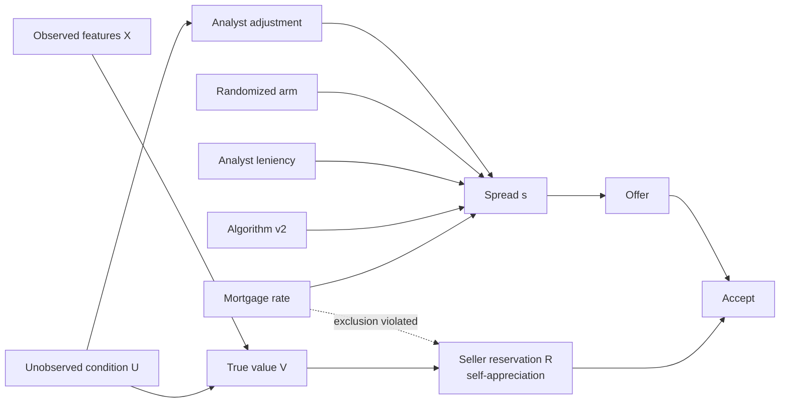

# Theory: valuation, the causal component, and margin optimization for an iBuyer

This note is the long-form companion to the code. Every claim about the simulated world is checked in
`run_all.py`; numbers quoted below are from `outputs/results.md` (seed 7) and will move slightly with other seeds.

---

## 0. The problem in one equation

An iBuyer is a market maker. For each seller lead it chooses an **offer**; for each home it owns it chooses a
**list price**. Expected contribution per lead is

$$
\mathbb{E}[\pi] \;=\; \underbrace{A(\text{offer})}_{\text{seller conversion}} \times
\Big(\underbrace{\mathbb{E}[\text{sale} \mid \text{list}]}_{\text{buyer conversion + price}} - \text{offer} - \text{repairs}
- \text{selling} - \underbrace{h\cdot \mathbb{E}[\text{days held}]}_{\text{holding}}\Big)
$$

Two models feed it:

| | Part 1 — **valuation** | Part 2 — **causal component** |
|---|---|---|
| Question | What is this home worth, and how sure are we? | If we move price, what happens to conversion? |
| Output | $\hat V$, prediction interval, $\hat V$ at resale | $\partial A/\partial s$ (acceptance vs spread), $\partial \log \text{DOM}/\partial \log p$, pass-through to sale price |
| Type | Prediction ($\mathbb{E}[V\mid X]$) | Intervention ($\mathbb{E}[Y \mid do(p)]$) |
| Failure mode | Error and **adverse selection** | **Confounding** → wrong-signed elasticities → wrong prices |

The interview trap is to answer Part 2 with Part 1 tools. A model that *predicts* acceptance well can still
have the wrong price coefficient, because it learns from prices that were set *using* information about the home.

---

## 1. The valuation model

### 1.1 Architecture
* **Target:** log sale price (errors are multiplicative; heteroskedasticity is roughly constant in logs).
* **Comps / repeat-sales layer:** index the home's last sale forward with a local price index; adjust nearest comps
  for feature differences. Strong where there is recent, similar inventory.
* **Hedonic layer:** $\log V = f(X) + \varepsilon$; in the repo a log-linear OLS baseline (interpretable, stable).
* **ML layer:** gradient-boosted trees (repo) or deep models with spatial structure; ensemble the layers.
* **Uncertainty:** quantile models (repo: 10th/90th pct) or conformal intervals; monitor coverage by segment.
* **Human in the loop:** pricing operators review low-confidence homes and inject information the model cannot see
  (condition, view, layout). *This is valuable for accuracy and toxic for causal inference* — see §3.
* **Time:** a separate forecast of home-price appreciation (HPA) over the expected hold, because the relevant value
  is the value at resale, not today.

### 1.2 How to evaluate it
* Median absolute % error (MdAPE), share within ±5%, **interval coverage**, and error by predicted-uncertainty bucket
  (repo fig 1: error rises monotonically with predicted uncertainty → the interval is informative).
* **Out-of-time** backtests (train on the past, test on the future) — random splits leak market moves.
* Evaluate on the **population you transact on**, not on all MLS sales. That population is selected (§1.3).

In the simulation the GBM barely beats the hedonic baseline (4.1% vs 4.3% MdAPE) because most of the error is the
unobserved condition $U$ that neither model sees. That is itself a talking point: past a point, accuracy comes from
*new information* (inspection, photos, seller answers), not a fancier learner.

### 1.3 Accuracy is not enough: adverse selection
Sellers know things the model doesn't. Let $e = \log(V/\hat V)$. A seller accepts when the offer beats their
reservation value, which is anchored on the true $V$. So acceptance is more likely when $\hat V$ is **too high**:

$$ \mathbb{E}[e \mid \text{accept}] < 0 = \mathbb{E}[e]. $$

In the sim: $\mathbb{E}[e\mid\text{accept}] = -2.6\%$, $\mathbb{E}[e\mid\text{reject}] = +0.8\%$ (fig 6c). An unbiased
model is **biased on the homes you buy**. Consequences:
1. The spread must cover expected adverse selection, and it should widen where model uncertainty is high.
2. Widening the spread changes *who* accepts: the marginal sellers who leave are the ones whose homes were worth more.
   The repo estimates this "winner's-curse slope" from the randomized spread arms: $c = -0.16$, i.e. one extra point of
   spread buys only ~0.84 points of margin on the accepted pool.
3. Evaluate the model on accepted homes and track realized resale vs $\hat V$ as a first-class metric.

---

## 2. "Customer self-appreciation"

The interviewer was almost certainly talking about the **seller's own valuation of their home** — how much the seller
*appreciates* (values) it relative to the market. It enters the conversion model directly:

$$
\text{accept} \iff \text{offer} \;\ge\; \underbrace{V e^{b}}_{\text{seller belief}}\,(1 - \tau - \kappa) \qquad
P(\text{accept}) = \sigma\!\big(\alpha + k\,[\log \text{offer} - \log(V e^{b}(1-\tau-\kappa))]\big)
$$

* $b$ = **self-appreciation**: endowment effect, anchoring on portal estimates or a neighbor's sale, and extrapolation of
  the neighborhood's recent appreciation ("prices went up 9% last year, so mine is worth 9% more").
* $\tau$ = cost of a traditional sale the seller avoids (commissions, prep, double move, carrying); $\kappa$ = value of
  speed/certainty (higher for urgent sellers).
* $k$ = price sensitivity (higher for sellers holding a competing agent quote).

Why it matters:
1. **It shifts the whole demand curve.** The same offer converts less where $b$ is high. In the sim, sellers add ~0.6 ×
   trailing market HPA to their belief; acceptance falls from 29% in a 1%-HPA market to 17% in a 9%-HPA market (fig 6a).
2. **It is the mechanism behind adverse selection.** Self-appreciation is anchored on the true $V$, which the seller
   knows better than the OVM.
3. **It is measurable.** Ask "what do you think your home is worth?" in the funnel. $\log(\text{stated}/\hat V)$
   recovers $b$ (sim: 2.9% + 0.62 × HPA vs truth 3% + 0.6 × HPA) and doubles the pseudo-R² of the conversion model.
4. **Use it carefully.** It is a great *predictor* and a great *segmentation* variable (explain the offer, show comps,
   set expectations), but pricing directly off a stated number invites strategic answers and fairness questions.

A second reading also deserves a sentence: the **asset** appreciates (or not) while you hold it. Expected HPA over the
hold adds to margin, and its variance is inventory risk — which is why holding time is costly beyond carrying costs
and why spreads widen when markets turn.

---

## 3. The causal component

### 3.1 Estimands
* Seller side: $\tau_s = \mathbb{E}\big[A_i(s_i + 1\text{pp}) - A_i(s_i)\big]$ — average effect of 1pp more spread on acceptance.
* Buyer side: $\theta = \partial \log \lambda / \partial \log p$ in a Weibull DOM model (log scale $\lambda$), the effect on
  $P(\text{sold} \le 60\text{d})$, and $\eta = \partial \log \text{sale} / \partial \log \text{list}$ (pass-through).

### 3.2 Why regression fails here

Analysts see condition $U$ and **cut** the spread for nicer homes; the same $U$ **raises** the seller's reservation.
So in observational data the homes with small spreads are exactly the homes whose sellers are hard to convert. The
naive regression finds almost no price effect (−0.27pp per pp vs truth −3.04; fig 2). On the buyer side, the pricing
team lists higher in hot markets and for nicer homes, both of which sell faster: naive OLS says price barely affects
time on market ($\hat\theta \approx 0$ vs 12).

**DML does not fix this.** It is flexible in $X$, but $U$ is not in $X$ (DML: −0.86). DML answers "have I controlled for
the observables well enough?", not "are there unobservables?".

The business consequence: an optimizer fed the naive elasticity concludes spread can be widened (and list prices
raised) at no volume cost, and walks to the edge of the grid (fig 7, 8). Regret: ~8% of contribution on the seller side,
~26% per home on the buyer side.

### 3.3 Identification ladder
1. **Randomized price experiments (gold standard).** Randomize a small offset to the spread / list price within
   strata. Estimate by 2SLS (offset → spread → outcome) so that non-compliance (analysts overriding) is handled.
   Cost: you knowingly make some worse offers; keep offsets small and stratified; power by segment.
2. **Quasi-experiments you already own** (IV / RD):
   * analyst leniency (judge design), algorithm-version cutovers, threshold rules (e.g. spread bands), rollouts by market.
3. **DML / doubly-robust** for the observable part and for nuisance functions inside IV (DML-IV, DRIV).
4. **Heterogeneity**: 2SLS by segment or causal forests on the experimental sample → segment-specific spreads.

### 3.4 Instrument selection (the part to slow down on)

| Instrument | Relevance | Independence / exclusion | Monotonicity | Main threat → diagnostic | Sim result |
|---|---|---|---|---|---|
| **Randomized spread arm** | Strong by design (F ≈ 33k) | Holds by construction | Holds (offset shifts everyone the same way) | Analysts undoing the offset (→ use 2SLS, not ITT); SUTVA if tests move local comps | −3.01 vs −3.04 ✅ |
| **Analyst leniency (leave-one-out)** | Strong if analysts differ (F ≈ 8k) | Needs quasi-random assignment (queue, shift); analyst must affect acceptance *only through price* — not through repair estimates, messaging, speed | "A lenient analyst is lenient on every home" — test with average-monotonicity / subgroup first stages | Assignment balance tests on pre-determined $X$; control for other analyst-touched levers | −2.74 vs −3.04 ✅ |
| **Algorithm v2 cutover (RD in time)** | Moderate (F ≈ 500) | Nothing else may change at the cutover (marketing, seasonality, macro) | Holds | Fragile: result depends on time trend spec; use narrow windows, placebo dates, stagger by market | −1.92 ± 1.2; across seeds from −1.1 to −7.8 ⚠️ |
| **Mortgage-rate shifter** | Weak/moderate | **Violated**: rates move sellers' willingness to sell directly | — | Over-ID test against valid IVs | +3.38 (wrong sign) ❌; Wooldridge over-ID p = 0.004 flags it |
| Hausman-style (prices in other markets) | Moderate | Violated by national demand shocks | — | Rarely credible here | not used |
| Repair-cost estimates | Moderate | Correlated with condition $U$ | — | Invalid | not used |

Notes that interviewers like:
* **LATE, not ATE.** Each IV identifies the effect for its compliers (homes whose price the instrument actually moves).
  An experiment on all offers and analyst leniency on reviewed offers can differ legitimately.
* **Over-ID tests only detect disagreement.** If every instrument is invalid in the same direction, the J-test passes.
  Randomization is the only instrument whose validity is not an assumption.
* **Binary outcome.** 2SLS on a linear probability model gives a weighted average effect and is robust. The control-function
  logit (2SRI) gives a full curve for optimization but leans on functional form (sim: −2.82 vs −3.04). Use the
  experiment to check the CF model where they overlap.
* **Leave-one-out** leniency avoids the mechanical correlation between a case's own spread and its analyst's mean.

### 3.5 Heterogeneity
Urgent sellers value speed (less price-sensitive per unit of gap); sellers with a competing agent quote are more
price-sensitive. Within-segment 2SLS on the experiment recovers the pattern (fig 5); the causal forest recovers it
with shrinkage toward the mean. Segment elasticities are what make segment-specific spreads worth anything (§5.3).

---

## 4. Worked example: "what if we change price by 3%?"

### 4.1 Rule of thumb from a logit
If $P = \sigma(\alpha + \beta p)$, then for a small change $\Delta p$

$$ \Delta P \approx \beta\,P(1-P)\,\Delta p \qquad \text{(average over homes, not at the average home).} $$

Seller side: with $k \approx 25$ log-odds per unit log-gap and $P = 0.23$, a 3% higher offer gives
$\Delta P \approx 25 \times 0.23 \times 0.77 \times 0.03 \approx 13$pp at the average; averaging over heterogeneous sellers
the truth is +9pp (23.3% → 32.4%). The linear causal estimate gives nearly the same answer: −3.0pp per 1pp of spread, and
1pp of spread is ≈1.2% of the offer, so a 3% higher offer ≈ 2.6pp less spread ≈ +8pp. Linear is fine locally; a curve is
needed for optimization.

### 4.2 Buyer side: list price 3% lower
With $P_{60} = 1 - \exp[-(60/\lambda)^k]$ and $\lambda \propto p^{\theta}$, a 3% cut multiplies $\lambda$ by
$0.97^{12} \approx 0.69$. From the repo (per bought home):

| | P(sold ≤ 60d) | E[DOM] | Δ revenue | Δ holding | **Δ contribution** |
|---|---|---|---|---|---|
| truth | 72% → 84% (+12pp) | 53 → 37 days | −$4.7k | −$1.1k | **−$3.4k** |
| causal model | 66% → 78% (+12.5pp) | 61 → 42 | −$4.7k | −$1.3k | **−$3.3k** |
| naive model | 67% → 67% (0pp) | 55 → 56 | −$8.0k | ≈ 0 | −$7.8k |

**Reading:** the cut buys ~12pp of 60-day conversion and ~16 fewer days on market, but at the current price level
it destroys ~$3.4k per home. It is the right move only if something outside this per-home objective binds — inventory
risk in a falling market, a capital limit, or a throughput target (§5.3). That nuance is the answer.

---

## 5. The optimization layer

### 5.1 Seller side: choose the spread
Maximize $\Pi(s) = A(s)\,m(s)$ with margin $m(s) = s + g + c\,(s - s_0)$ (share of $\hat V$). First-order condition:

$$ m(s^\*) \;=\; (1+c)\,\frac{A(s^\*)}{-A'(s^\*)} \;\stackrel{\text{logit}}{=}\; \frac{1+c}{\tilde k\,(1-A(s^\*))} $$

— the iBuyer version of the Lerner markup rule: less price-sensitive sellers (low $\tilde k$) get wider spreads;
adverse selection ($c<0$) *lowers* the optimal markup because each point of spread is worth less. In the sim the causal
planner picks +3.0pp vs current (truth +3.0pp), the planner that ignores the winner's curse picks +3.5pp, the naive
planner runs to the +6pp bound and loses ~8% of contribution.

### 5.2 Buyer side: choose the list price
Maximize $\mathbb{E}[\text{sale}](p)(1-\text{sell}) - h\,\hat V\,(\text{reno} + \mathbb{E}[\text{DOM}](p))$. Needs *two*
causal objects: $\theta$ (speed) and the pass-through curve $\eta(p)$ (over-pricing is negotiated away and stale listings
take cuts). With a single price-cut arm you only identify a local slope; the repo randomizes three arms (−3%, 0, +3%)
to identify curvature. Causal planner: 1.015 × current (truth 1.025, regret $136/home). Naive: 1.08, regret $3.1k/home.

### 5.3 Volume targets and capital
$\max \sum_g \Pi_g(s_g)$ s.t. $\sum_g A_g(s_g) \ge V^\*$ → maximize $\Pi_g + \lambda A_g$ per segment.
$\lambda$ is the **shadow price of volume**: how much margin you give up for one more acquisition. Sweeping $\lambda$
traces the margin–volume frontier (fig 9). Segment-specific spreads dominate a uniform change because the model knows
where volume is cheap (price-sensitive segments). +30% volume needs $\lambda \approx \$7k$ per acquisition.

### 5.4 Uncertainty and learning
* Propagate elasticity uncertainty into the decision (fig 10): choose the price that maximizes *expected* profit over the
  posterior, not the plug-in optimum. When the profit curve is asymmetric (over-pricing is costlier than under-pricing),
  the robust choice shades toward the safe side.
* Keep experimenting: small, always-on randomized offsets (or Thompson sampling over spread arms by segment) keep the
  elasticity current as markets move — elasticities estimated in 2021 were wrong in 2022.
* Guardrails: floors/caps on spread by uncertainty bucket; kill-switch metrics (realized resale vs $\hat V$ on accepted homes).

---

## 6. Relation to a recommended-pricing project

A recommended-pricing system (recommend a price that maximizes an objective given a price-response curve) is the same
three-layer stack: **(1) a value/demand model, (2) a causal price-response estimate, (3) an optimizer with business
constraints**. What transfers directly: experiment design for price, elasticity estimation, the markup/FOC logic,
segment-level optimization, and guardrails. What must be added for an iBuyer:
* **Principal risk** — the company owns the asset, so holding time, HPA and inventory risk enter the objective.
* **Adverse selection** — the counterparty is better informed; margin on accepted deals depends on the price.
* **Two sides** — acquisition and disposition prices interact through the same valuation error.
* **Thin, unique inventory** — each home trades rarely, so experiments must pool across homes via relative price
  (spread, list/value ratio) rather than per-item price tests.

(The uploaded `MLADS_RecommendedPricing.docx` is rights-managed and could not be opened in the sandbox; paste the
relevant sections to tailor this mapping.)
