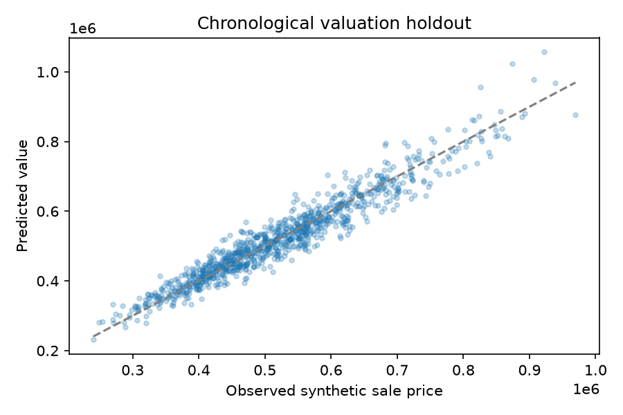
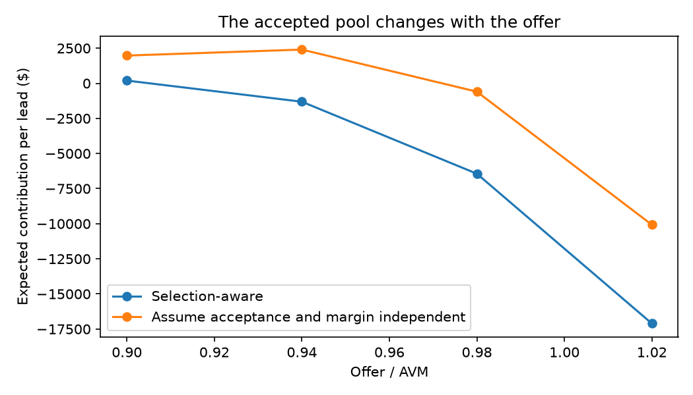
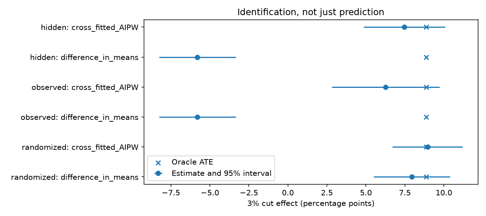
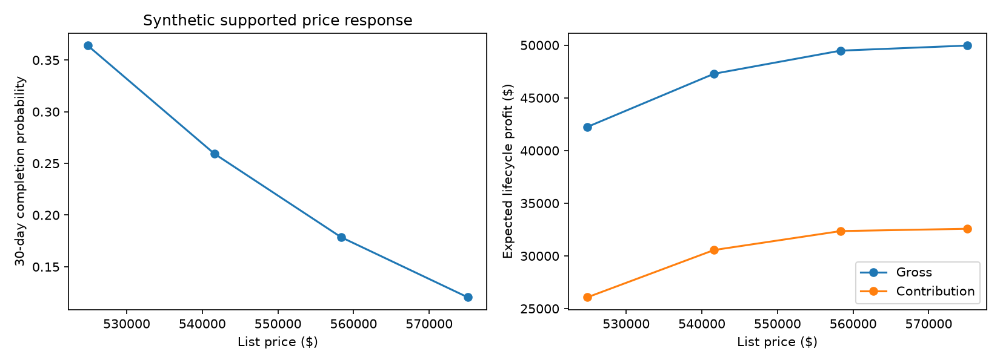
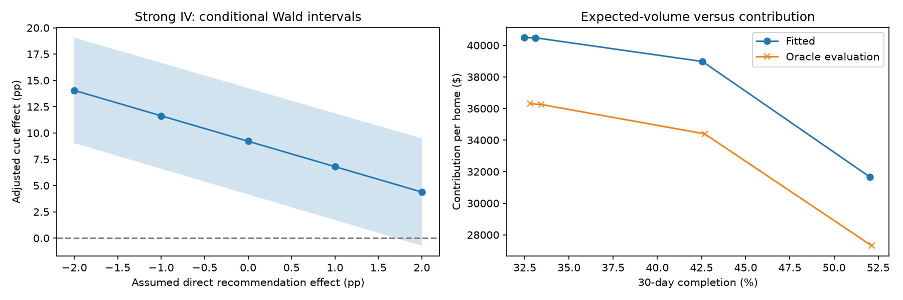

# Home valuation, causal pricing, and profit optimization

## Scope and decision framework

This chapter explains the statistical and economic reasoning behind the
implemented synthetic lab. It complements the [repository architecture](architecture.md),
[data contracts](data_dictionary.md), and [generated reference results](reference_results.md).
The [linked two-sided chapter](two_sided_extension.md) separately derives the
acquisition-to-resale policy evaluation.

The system separates four objects:

| Object | Question |
|---|---|
| Valuation | What is the asset's market value and uncertainty at the decision date? |
| Behavioral response | How do homeowner acceptance and buyer completion differ? |
| Causal response | How does a supported intervention change the relevant outcome? |
| Economic decision | Which feasible action maximizes the stated lifecycle objective? |

All numerical examples below are synthetic. Public sources motivate the
context and methods, not the simulator's coefficients, fees, or accuracy.
Source identifiers refer to the [claim ledger](sources.md) and its recorded
verification limits.

## 1. Populations, units, and estimands

Market value, homeowner belief, reservation utility, acquisition offer,
seller net proceeds, resale list price, and transaction proceeds are different
quantities. Acceptance, contract signing, and completed closing are also
different endpoints. A model must specify which one it predicts or changes.

The main causal target is:

$$
\tau =
E\!\left[Y_i(0.97P_{i0})-Y_i(P_{i0})
\mid i\text{ is eligible and still unsold at }t_0\right],
$$

where \(Y_i\) is completed resale in the 30 days after the decision.
Eligibility is determined before treatment assignment. This is not an
initial-listing experiment on all inventory.

The baseline acquisition companion instead randomizes final offer/AVM ratios
over 0.90, 0.94, 0.98, and 1.02. Its response endpoint is acceptance within
14 days, followed by a separate completed-acquisition event. Raising an
acquisition offer generally increases seller response; lowering a resale
list price generally increases buyer response. These opposite price
directions must not be conflated.

A proportional 3% reduction in an offer/AVM ratio of 0.94 produces
\(0.94\times0.97=0.9118\), not 0.91. A probability change of 0.08 is eight
percentage points, not an eight-percent relative change.

## 2. Valuation and point-in-time uncertainty

The valuation target is a transaction value under a specified date, condition,
market, and sale process. A model fitted to completed transactions does not
automatically identify values for rejected offers, unlisted homes, or every
possible future pricing strategy.

`features.py` constructs size, age, condition, market, time, seasonality, and
comparable-sale features. The comparable feature uses up to 40 strictly
earlier sales in the same market; same-day and future transactions are
excluded. Imputation, scaling, and categorical encoding are fitted on the
training partition. Explicit feature lists keep future outcomes and
evaluator-only truth out of the models.

`valuation.py` compares a regularized hedonic model,

$$
\log V_i=\alpha+\beta^\top X_i+\varepsilon_i,
$$

with histogram gradient boosting on the same log-price target. Both apply a
training-residual smearing correction when returning to dollar predictions.
Chronological boundaries allocate approximately 60% to training, 10% to
tuning, 10% to calibration, and 20% to future testing. Tuning performance
selects the model; the final test partition does not.

The selected hedonic model has future-test MAE about **$25,384**, RMSE
**$33,381**, and mean absolute relative error **4.92%**. The nonlinear
alternative's MAE is approximately **$32,384**. Complexity is evaluated, not
assumed to improve extrapolation.

Split-conformal absolute residuals supply nominal 90% intervals, but measured
future coverage is **86.21%**, with width approximately **$97,393**. These are
marginal intervals, not a calibrated joint distribution of value, repairs,
holding time, and market shocks. Exchangeability can fail under temporal or
geographic shift [S9].

Diagnostics include market and price-quartile slices, tail relative error,
bias, and a held-out-geography experiment excluding Metro-D from fitting
and comparable history. Test-price quartiles are evaluation slices, not
decision-time predictors.



## 3. Homeowner behavior and selection-aware acquisition

### Belief, condition, and reservation utility

A homeowner's market belief is not verified condition, and neither is the
owner's reservation utility. A useful conceptual decomposition is:

$$
\begin{aligned}
R_i={}&\text{expected net value of the best alternative}\\
&+\text{attachment}+\text{option value of waiting}\\
&-\text{convenience benefit of a prompt sale}.
\end{aligned}
$$

Acceptance depends on net proceeds relative to this outside option, not only
on the offer relative to an AVM. The stipulated profiles in `seller.py` hold
asset value at $500,000 while varying convenience and attachment:

$$
N(O)=0.98O-6{,}000-3{,}000,\qquad
q_{\mathrm{accept}}(O)
=\operatorname{logit}^{-1}\!\left(\frac{N(O)-R}{12{,}500}\right).
$$

At a $470,000 offer, net proceeds are $451,600. Reservation values of $455,000
and $510,000 imply about 43.2% and 0.9% acceptance respectively. These are
chosen illustrations, not fitted population laws.

Expectations can affect selling choices [S5], but an information experiment's
intention-to-treat effect is not an offer-price elasticity. Likewise,
substituting optimistic self-reported condition for verified condition raises
the fixed AVM's MAE from about $25,384 to $27,108; this is a measurement-shift
ablation, not the causal commercial value of inspection.

### Ledger and joint economic objective

The illustrative acquisition ledger separates company outlay \(K\) from
seller net proceeds \(N\):

$$
K(O)=0.98O-6{,}000,\qquad N(O)=K(O)-3{,}000.
$$

The retained charge and repair credit already reduce outlay. Seller closing
costs are not company revenue, and actual repair spending is a separate
expense. These assumptions do not describe current company fees [S2].

Fit response on all offers, not only accepted offers. The baseline simulator
separates acceptance from a stipulated 96% conditional probability of closing.
For completed-acquisition indicator \(C_i(O)\) and subsequent margin
\(M_i(O)\), the relevant prospect-level objective is:

$$
J(O)=E[C_i(O)M_i(O)]-c_{\mathrm{quote}}(O).
$$

Generally, \(E[CM]\ne E[C]E[M]\): the offer changes which homes are acquired.
For a fixed observed profile, let \(q_c(O)\) be completion probability and
\(\mu(O)\) the selected expected net exit value before acquisition outlay:

$$
J(O)=q_c(O)[\mu(O)-K(O)]-c_{\mathrm{quote}}(O),
$$

$$
J'(O)=q_c'(O)[\mu(O)-K(O)]
+q_c(O)[\mu'(O)-K'(O)]-c_{\mathrm{quote}}'(O).
$$

The derivative includes the changing quality of selected inventory.
Across heterogeneous profiles, preserve the joint expectation rather than
multiplying unconditional averages.

At offer/AVM ratio 0.94, the reference oracle acquisition probability is
about 14.05%, and acquired inventory has average AVM overvaluation near
$26,432. Selection-aware contribution is approximately **-$1,311 per prospect**;
factorizing completion and unconditional margin incorrectly gives **+$2,401**.
At ratio 0.90, the joint derivative is about -$118 per one percentage-point
increase in offer/AVM ratio, versus +$272 from factorization. These quantities
use evaluator-only truth; they are not deployable acquisition estimates.



## 4. Identify price response before optimizing it

Historical cuts often respond to weak demand:

```text
weak demand -> low pre-decision engagement -> price cut
weak demand -------------------------------> low completion
price cut ---------------------------------> higher completion
```

Consequently, an observational association can have the opposite sign from
the causal effect. Post-cut views or negotiations are mediators, not
pretreatment controls for the total cut effect.

The preferred baseline design randomizes eligible homes between hold and a
3% cut, logs assigned and delivered actions, and follows the prespecified
completed-sale endpoint. With full delivery, the assignment effect equals
the delivered-action effect. With overrides, retain intention-to-treat
analysis rather than conditioning on compliance.

### Cross-fitted augmented inverse-propensity weighting

For binary action \(A\), permitted covariates \(X\), propensity \(e(X)\), and
outcome regressions \(m_a(X)\), `causal.doubly_robust` computes:

$$
\widehat\tau=\frac1n\sum_i
\left[
\widehat m_1(X_i)-\widehat m_0(X_i)
+\frac{A_i(Y_i-\widehat m_1(X_i))}{\widehat e(X_i)}
-\frac{(1-A_i)(Y_i-\widehat m_0(X_i))}{1-\widehat e(X_i)}
\right].
$$

Nuisance models are fitted on other folds. The randomized fixture uses its
known propensity 0.5; observational fixtures estimate propensities from
allowlisted covariates. Consistency, overlap, and conditional exchangeability
remain necessary. Cross-fitting and double robustness do not remove
unobserved confounding [S7].

| Binary resale design | Estimate, percentage points |
|---|---:|
| Matching oracle population effect | +8.86 |
| Randomized difference in means | +7.94 |
| Randomized cross-fitted AIPW | +8.95 |
| Confounded difference in means | -5.80 |
| AIPW with the measured assignment confounder | +6.27 |
| AIPW with only a noisy proxy | +7.45 |

The proxy-based estimate happens to be closer to truth in this realization;
that does not validate its identification assumptions. The implementation
reports balance and propensity diagnostics and rejects zero/one estimated
propensities rather than silently clipping them.



### Supported multi-action response

A separate randomized sample uses signed price changes
\(\{-0.06,-0.03,0,0.03\}\). Logistic response models include predecision
features, log price action, and an action-by-condition interaction. Training
uses earlier decision dates; later dates supply calibration and policy
evaluation.

The optimizer uses only the tested grid. A smooth fitted function does not
justify an unsupported 20% cut, and a finite-sample fit need not be monotone.
Neither extrapolation nor imposing monotonicity repairs an unidentified
causal design.

## 5. Instrumental variables: local targets and diagnostics

An encouragement instrument is useful when assignment \(Z\) changes delivered
treatment \(D\) without forcing compliance. With binary \(Z\) and \(D\),
relevance, independent assignment, exclusion, monotonicity, and the usual
consistency/no-interference assumptions yield the complier effect:

$$
\operatorname{LATE}=
\frac{E[Y\mid Z=1]-E[Y\mid Z=0]}
     {E[D\mid Z=1]-E[D\mid Z=0]}.
$$

Report the reduced form and first stage alongside this ratio. A complier
LATE is not automatically an all-home ATE or a global continuous-price curve.
Random assignment alone establishes neither exclusion nor monotonicity.

| Candidate design | Main identification concern |
|---|---|
| Random recommendation with otherwise fixed services | Assignment must not change outcomes through messaging, service, or exposure independent of delivered treatment |
| Direct randomized numeric price perturbation | With full delivery, analyze the treatment experiment directly; an IV is unnecessary |
| Quasi-random reviewer assignment | Routing, case mix, timing, negotiation, and reviewer skill can violate independence or exclusion |
| Policy threshold | A local sharp/fuzzy regression-discontinuity argument needs continuity, no precise manipulation, and no other policy jump |
| Rollout date or geography | Time trends, concurrent launches, targeted rollout, and local shocks can confound assignment |
| Rates, neighborhood prices, inventory, or seller beliefs | These can directly affect demand, value, or reservation utility, making exclusion implausible |

The reviewer fixture uses scores from a separate historical sample.
Removing an observation from its own score does not eliminate case sorting
or direct reviewer effects. Reviewer-clustered inference has only 16 clusters
here and is explicitly qualified; the lab does not implement UJIVE [S10].

### Weak identification and imperfect exclusion

`instruments.py` reports first-stage coefficients, partial \(R^2\), reduced
forms, and the diagnostic reference distribution. With robust covariance,
`linearmodels` returns a chi-squared Wald statistic in `f.stat`, not an
ordinary F statistic [S11].

The one-instrument heteroskedasticity-robust Anderson-Rubin procedure inverts
tests of \(Y-\beta_0D\) against the instrument and controls. Confidence sets
may be bounded, disjoint, empty, or unbounded. This implementation assumes
independent observations and is not used for the reviewer-clustered fixture.

| Fixture | IV estimate, probability units | Interpretation |
|---|---:|---|
| Strong valid encouragement | 0.092 | The matching oracle LATE is 0.163; this realization's nominal interval misses it |
| Weak encouragement | -0.458 | An unstable ratio; the AR set is approximately [-2.271, 0.191] |
| Direct-path violation | 0.405 | Strength does not repair exclusion |
| Nonrandom assignment | 0.481 | Strength does not repair assignment confounding |

These fixtures have a different data-generating process from the primary
resale ATE. A weak linear IV coefficient is not a probability prediction for
the price optimizer. Across 30 prespecified repetitions, 26 nominal intervals
cover the matching oracle LATE: 86.7% observed coverage with about 6.2
percentage points of Monte Carlo standard error. This is a small diagnostic,
not certification of nominal coverage.

For an assumed direct recommendation effect \(\gamma\), the sensitivity
analysis re-estimates IV and AR inference using \(Y-\gamma Z\):

$$
\beta(\gamma)=
\frac{\text{reduced form}-\gamma}{\text{first stage}}.
$$

In the strong fixture, an assumed direct +1 percentage-point effect changes
the estimated cut effect from 9.21 to 6.80 points. Each interval conditions on
the chosen \(\gamma\); the analysis does not estimate that direct effect.

### Continuous offers and units

The continuous companion has \(T=\log(O/O_0)\), randomized
\(Z\in\{-1,0,1\}\), and encouragement shifts of approximately
\(\pm0.015\) log-offer units. Its stipulated constant probability slope is 3;
the fitted slope is about 3.773 with interval [2.864, 4.682].

Multiplying by \(\log(0.97)\) yields approximately -0.115 probability units.
That is a local linear approximation, not a randomized finite 3% contrast.
Heterogeneous continuous IV has a weighted local interpretation. Substituting
first-stage predictions into an arbitrary nonlinear model is not standard
2SLS, and one binary instrument cannot separately instrument both \(T\) and
\(T^2\) merely by adding \(Z^2=Z\).

## 6. From a completion curve to lifecycle contribution

Let \(q(P)\) denote completion within 30 days, \(S(P)\) expected early
transaction proceeds, \(W\) terminal proceeds, \(C\) acquisition basis,
\(s\) the selling-cost rate, \(h\) daily cash holding cost, and \(r\) the
annual financing rate. `optimization.profit_matrices` uses:

$$
R(P)=q(P)S(P)+(1-q(P))W,\qquad G(P)=R(P)-C,
$$

$$
\Pi(P)=(1-s)R(P)-C-
\left(h+\frac{rC}{365}\right)d(P),
$$

$$
S(P)=0.99P,\qquad W=0.94\widehat V,\qquad
d(P)=18q(P)+45(1-q(P)).
$$

The 45-day terminal time is relative to the repricing decision. The generator
uses hidden true value for terminal proceeds; planners substitute AVM.
Basis is charged once in every disposition state, and an unsold home retains
an asset value. The simplified objective \(q(P)(P-C)\) omits both facts.

Under fixed \(W\), the gross-profit derivative is:

$$
G'(P)=q'(P)[S(P)-W]+q(P)S'(P).
$$

Contribution also reflects selling and time-dependent costs. If the current
action changes subsequent continuation value, its derivative must be included
as well; the fixed terminal policy here deliberately avoids that additional
dynamic problem.

For the reference profile, a 3% cut raises predicted completion from
**17.86% to 25.93%** while reducing contribution from **$32,358 to $30,559**.
This is a fitted conditional contrast, not an individually randomized effect.



For a separate stipulated illustration, starting at \(q=0.4\) with log-odds
coefficient \(\beta=-12\):

$$
\operatorname{logit}q(0.97P)
=\operatorname{logit}(0.4)-12\log(0.97),
$$

giving about 49.00% completion. The nine-point increase is approximately a
22.5% relative increase. The slope is not itself a probability elasticity:

$$
\frac{dq}{d\log P}=\beta q(1-q),\qquad
\frac{d\log q}{d\log P}=\beta(1-q).
$$

Gross-margin percentage \(E[G]/E[R]\), gross-profit dollars, and contribution
dollars are reported separately. Maximizing a ratio is not generally
equivalent to maximizing prospect-level or portfolio profit.

## 7. Supported optimization, stress, and portfolio constraints

The individual optimizer enumerates supported actions subject to a price
floor. An impossible floor produces an explicit error/abstention, not an
invented feasible recommendation.

A separate stress policy maximizes worst predicted contribution over five
named scenarios: reference, lower terminal value, expensive holding, higher
terminal value, and combined lower terminal value with expensive holding.
This is a scenario objective, not a confidence bound or protection against
every market shock.

The portfolio optimizer permits lotteries \(w_{ia}\) over supported prices:

$$
\begin{aligned}
\max_w\quad &\sum_{i,a}w_{ia}\widehat\Pi_{ia}\\
\text{subject to}\quad
&w_{ia}\ge0,\quad \sum_a w_{ia}=1,\\
&w_{ia}=0\text{ for infeasible actions},\\
&\frac1n\sum_{i,a}w_{ia}\widehat q_{ia}\ge Q_{\min}.
\end{aligned}
$$

A fractional solution randomizes between tested prices; quoting their
average would be a different, unsupported intervention. Infeasible completion
targets raise errors.

Increasing fitted completion from 32.46% to 42.56% reduces fitted
contribution from about $40,485 to $38,975 per home. At the latter point, the
local shadow price is approximately $31,144 per additional expected
completion, not per percentage point. There is no upward marginal value at
the maximum supported completion endpoint.

These constraints use fitted probabilities, not guaranteed realized volume.
Capital paths, concentration constraints, correlated market shocks, and
repeated dynamic repricing remain outside the implemented optimizer.



## 8. Held-out policy evaluation and uncertainty

The response model trains on earlier decisions; frozen policies are scored
on later randomized decisions. With observed mature reward \(R_i\),
logging propensity \(e\), and reward prediction \(\widehat m\), a
deterministic policy \(\pi\) has the doubly robust score [S8]:

$$
\psi_i^\pi=
\widehat m(X_i,\pi(X_i))
+\frac{\mathbf1\{A_i=\pi(X_i)\}}{e(A_i\mid X_i)}
\left[R_i-\widehat m(X_i,A_i)\right].
$$

For a supported-price lottery:

$$
\psi_i^w=
\sum_a w_{ia}\widehat m(X_i,a)
+\frac{w_{iA_i}}{e(A_i\mid X_i)}
\left[R_i-\widehat m(X_i,A_i)\right].
$$

The reward is lifecycle contribution under the stated terminal policy, not
30-day completion alone. Missing or immature closing rewards are rejected.
For two policies, calculate the mean and standard error of their same-home
score differences; subtracting separate confidence intervals discards their
covariance.

The reference contribution policy improves estimated value over hold by
about **$230 per home**, with a pointwise interval of approximately
**[-$3,430, $3,890]**. Superiority is not established. Oracle evaluation is
available only because the generator supplies hidden truth; it is not a
production-observable performance measure.

Bootstrap bands refit the response with the AVM, profile, and economic
assumptions fixed. They are pointwise, and 30 repetitions are intentionally
modest. Policy intervals condition on frozen learned rules and do not cover
all policy search, valuation error, market drift, or correlated portfolio
risk.

For commands and examples, use the [README](../README.md). For the
two-stage analogue of these scores and the different eligible/original-cohort
denominators, see the [linked experiment](two_sided_extension.md).
