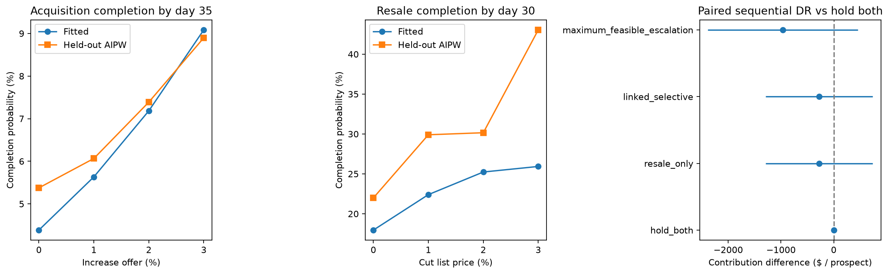

# Linked two-sided extension: generated results

This is an additive synthetic experiment, not a replacement for the original study.
Probabilities are fractions. Policy values are USD per escalation-eligible prospect, except the explicitly labeled all-original-prospects table.
A negative lower bound or weak policy ranking is retained, not tuned away.

Configuration: `{"n_continuation": 10000, "n_development": 12000, "n_evaluation": 8000, "n_market": 5000, "seed": 42}`

## Cohort Funnel

| cohort | prospects | initial_acceptances | escalation_eligible | stage_acceptances_14d | stage_acquisitions_35d | all_acquisitions | early_resales | markdown_eligible | post_markdown_closes_30d | first_offer | last_reward_mature |
| --- | --- | --- | --- | --- | --- | --- | --- | --- | --- | --- | --- |
| development | 12000 | 1359 | 6158 | 694 | 666 | 1976 | 274 | 1417 | 316 | 2022-01-30 | 2023-02-03 |
| continuation | 10000 | 973 | 5181 | 583 | 561 | 1504 | 223 | 1045 | 263 | 2023-03-06 | 2024-03-09 |
| evaluation | 8000 | 728 | 4214 | 377 | 366 | 1060 | 143 | 750 | 237 | 2024-04-09 | 2025-04-13 |

## Stage Effects

| stage | action_magnitude | common_support_n | fitted_completion | aipw_completion | effect_vs_hold | lower | upper | oracle_effect_vs_hold |
| --- | --- | --- | --- | --- | --- | --- | --- | --- |
| buy | 0.00000 | 2457 | 0.04385 | 0.05376 | 0.00000 | 0.00000 | 0.00000 | 0.00000 |
| buy | 0.01000 | 2457 | 0.05634 | 0.06066 | 0.00690 | -0.01767 | 0.03146 | 0.01110 |
| buy | 0.02000 | 2457 | 0.07184 | 0.07389 | 0.02013 | -0.00456 | 0.04481 | 0.02394 |
| buy | 0.03000 | 2457 | 0.09084 | 0.08898 | 0.03522 | 0.00878 | 0.06165 | 0.03867 |
| sell | 0.00000 | 750 | 0.17956 | 0.21992 | 0.00000 | 0.00000 | 0.00000 | 0.00000 |
| sell | 0.01000 | 750 | 0.22399 | 0.29902 | 0.07910 | -0.00494 | 0.16314 | 0.02746 |
| sell | 0.02000 | 750 | 0.25234 | 0.30157 | 0.08165 | -0.00562 | 0.16893 | 0.05736 |
| sell | 0.03000 | 750 | 0.25931 | 0.43052 | 0.21060 | 0.11657 | 0.30462 | 0.08962 |

## Buy Value Curve

| action_magnitude | common_support_n | mean_gross_offer | fitted_completion | joint_value_hold_resale | joint_value_optimized_resale | incremental_value_optimized_resale |
| --- | --- | --- | --- | --- | --- | --- |
| 0.00000 | 2457 | 492200.32805 | 0.04385 | 1931.94061 | 1275.27994 | 0.00000 |
| 0.01000 | 2457 | 497122.33133 | 0.05634 | 1066.97701 | 556.91263 | -718.36731 |
| 0.02000 | 2457 | 502044.33461 | 0.07184 | 335.17106 | 176.82772 | -1098.45222 |
| 0.03000 | 2457 | 506966.33789 | 0.09084 | -263.47723 | 135.02520 | -1140.25474 |

## Policy Evaluation

| policy | n_eligible_sellers | dr_value | value_lower | value_upper | difference_vs_hold_both | difference_lower | difference_upper | escalation_share | path_weight_ess |
| --- | --- | --- | --- | --- | --- | --- | --- | --- | --- |
| hold_both | 4214 | -13.59454 | -947.83644 | 920.64736 | 0.00000 | 0.00000 | 0.00000 | 0.00000 | 1268.82788 |
| resale_only | 4214 | -287.27777 | -1443.91818 | 869.36264 | -273.68323 | -1287.60459 | 740.23813 | 0.00000 | 1230.59056 |
| linked_selective | 4214 | -287.27777 | -1443.91818 | 869.36264 | -273.68323 | -1287.60459 | 740.23813 | 0.00000 | 1230.59056 |
| maximum_feasible_escalation | 4214 | -978.39143 | -2085.24950 | 128.46663 | -964.79689 | -2386.37678 | 456.78300 | 0.67205 | 1166.67790 |

## Cohort Policy Evaluation

| policy | n_original_prospects | dr_value_per_original_prospect | value_lower | value_upper | difference_vs_hold_both | difference_lower | difference_upper |
| --- | --- | --- | --- | --- | --- | --- | --- |
| hold_both | 8000 | -913.15065 | -1556.53206 | -269.76925 | 0.00000 | 0.00000 | 0.00000 |
| resale_only | 8000 | -908.49625 | -1638.98408 | -178.00842 | 4.65441 | -713.20975 | 722.51856 |
| linked_selective | 8000 | -908.49625 | -1638.98408 | -178.00842 | 4.65441 | -713.20975 | 722.51856 |
| maximum_feasible_escalation | 8000 | -1272.54037 | -1981.19437 | -563.88637 | -359.38971 | -1248.73497 | 529.95554 |

## Buy Action Mix

| chosen_escalation | homes | mean_predicted_gain |
| --- | --- | --- |
| 0.00000 | 4214 | 0.00000 |

## Interpretation

Stage contrasts are restricted to homes eligible for every action at that stage.
The joint policy score instead covers all engaged initial nonacceptors, including those whose only feasible acquisition action is hold and those who never acquire.
The resale-only comparison keeps acquisition escalation at zero; linked-selective also may change escalation using the learned joint continuation objective. Inspect the action mix: a policy is allowed to choose hold for everyone.

The cohort-policy table uses all original prospects, including initial acceptors and nonengaged sellers. Its denominator differs from the stage-eligible table. Initial offer/eligibility rules are fixed and initial marketing/quote costs are excluded.

Only past cohorts supply model parameters. Oracle probabilities are used for the stage-effect diagnostic column, never for policy selection.

See the repository's `docs/data_dictionary.md` and `docs/design_implementation_summary.md` for timing, support, accounting, and inference assumptions. Stage-score and continuation-reward equations are implemented in `src/home_valuation/two_sided.py`.
