# Results (auto-generated by `run_all.py`)

seed = 7, offers = 25,000, acceptance = 22.9%, homes bought = 5,719

Portfolio at current policy: gross margin 8.0%, contribution margin 3.6%, median DOM 36 days

## 1. Valuation model (OVM)
|   hedonic_median_ape |   gbm_median_ape |   gbm_within_5pct |   interval80_coverage |
|---------------------:|-----------------:|------------------:|----------------------:|
|               0.0430 |           0.0410 |            0.5881 |                0.7558 |

Median |log error| by predicted-uncertainty quintile: [0.035, 0.0386, 0.04, 0.042, 0.0519]

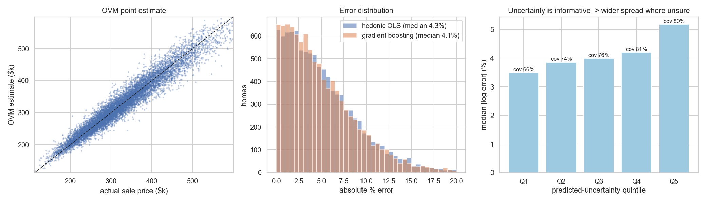

## 2. Causal effect of price on conversion

### Seller side — +1pp spread → acceptance (pp)
| estimator                             |   estimate |     se |   truth |   bias | note                                         |
|:--------------------------------------|-----------:|-------:|--------:|-------:|:---------------------------------------------|
| Naive OLS (LPM)                       |      -0.32 |   0.17 |   -3.00 |   2.68 | controls for X only                          |
| Naive logit (AME)                     |      -0.31 |   0.17 |   -3.00 |   2.69 | controls for X only                          |
| DML (X only)                          |     nan    | nan    |   -3.00 | nan    | econml unavailable: No module named 'econml' |
| 2SLS: randomized spread arm           |      -2.66 |   0.30 |   -3.00 |   0.34 | first-stage F = 11,856                       |
| 2SLS: analyst leniency (LOO)          |      -3.19 |   0.39 |   -3.00 |  -0.19 | first-stage F = 5,812                        |
| 2SLS: algorithm v2 cutover            |       0.55 |   1.48 |   -3.00 |   3.55 | first-stage F = 291                          |
| 2SLS: mortgage-rate shifter (INVALID) |       3.45 |   1.95 |   -3.00 |   6.45 | first-stage F = 187                          |
| 2SLS: all valid IVs                   |      -2.78 |   0.23 |   -3.00 |   0.22 | Wooldridge over-id p = 0.045                 |
| 2SLS: valid + rate (J-test)           |      -2.74 |   0.23 |   -3.00 |   0.26 | Wooldridge over-id p = 0.006                 |
| Control-function logit (2SRI) AME     |      -2.66 |   0.21 |   -3.00 |   0.34 | residual coef = 0.344 (endogeneity test)     |

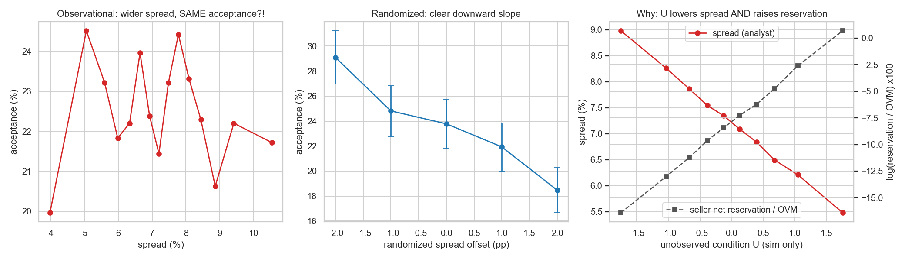

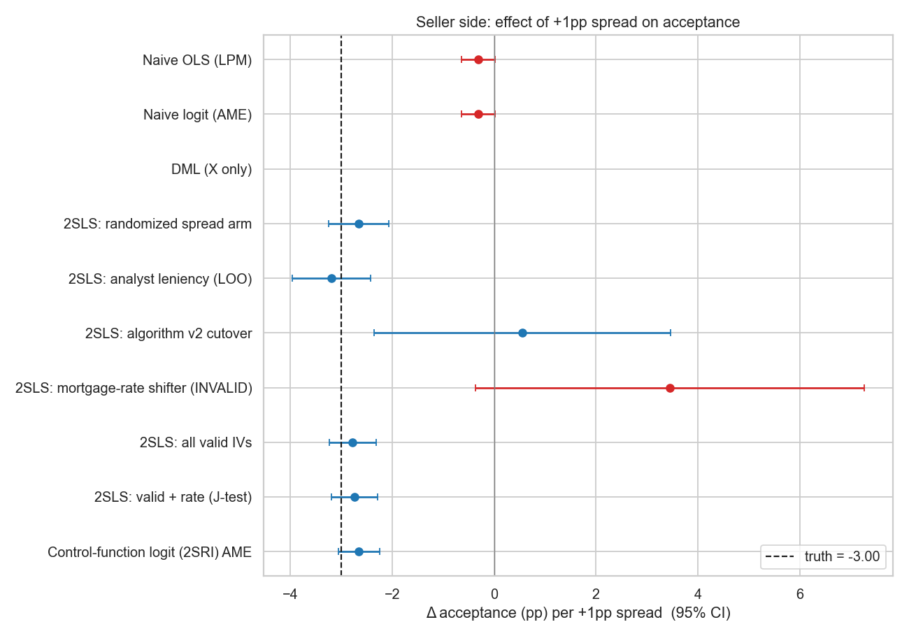

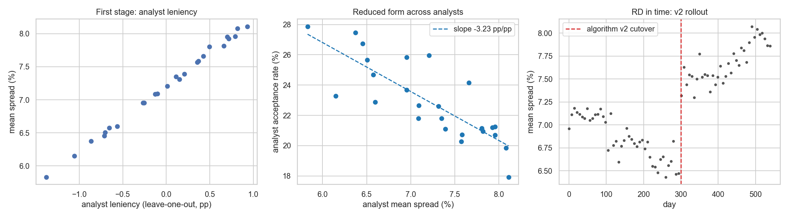

### Buyer side — +1% list price → P(sold ≤ 60d) (pp); log DOM elasticity θ/100
| estimator                       |   estimate |    se |   truth |   bias | note                                        |
|:--------------------------------|-----------:|------:|--------:|-------:|:--------------------------------------------|
| Naive OLS: sold<=60d            |     -0.485 | 0.233 |  -4.561 |  4.076 | U and local demand heat confound list price |
| 2SLS: randomized list-price arm |     -5.445 | 0.445 |  -4.561 | -0.884 | first-stage F = 2,229                       |
| Naive OLS: log DOM (theta/100)  |      0.003 | 0.006 |   0.120 | -0.117 |                                             |
| 2SLS: log DOM (theta/100)       |      0.133 | 0.011 |   0.120 |  0.013 |                                             |

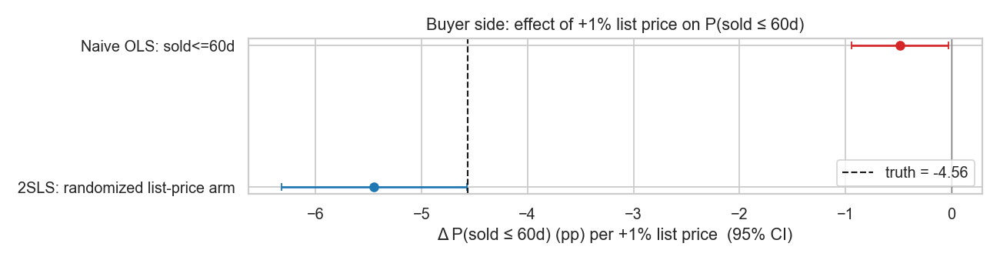

### Heterogeneity (+1pp spread, pp acceptance)
| urgency   |   has_agent_quote |    n |   iv_hat |   iv_se |   cate_true |   cate_hat |
|:----------|------------------:|-----:|---------:|--------:|------------:|-----------:|
| high      |                 0 | 3240 |    -1.89 |    1.05 |       -3.05 |      -1.89 |
| high      |                 1 | 1732 |    -3.15 |    1.33 |       -3.97 |      -3.15 |
| low       |                 0 | 7331 |    -2.74 |    0.49 |       -2.63 |      -2.74 |
| low       |                 1 | 3866 |    -1.90 |    0.52 |       -2.03 |      -1.90 |
| medium    |                 0 | 5782 |    -2.82 |    0.70 |       -3.60 |      -2.82 |
| medium    |                 1 | 3049 |    -3.73 |    0.76 |       -3.38 |      -3.73 |

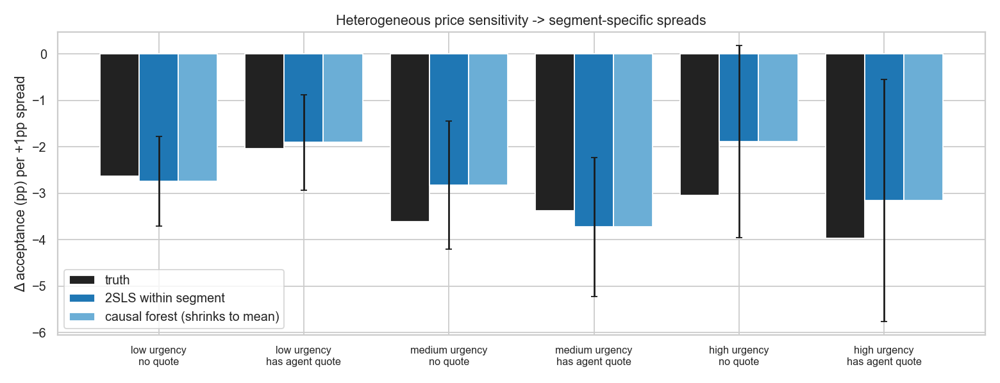

## 3. Customer self-appreciation

Sellers' stated value exceeds the OVM by 2.9% + 0.62 × trailing market HPA (true: 3% + 0.6 × HPA).

Adding the stated value to the acceptance model lifts pseudo-R² from 0.126 to 0.268.

OVM error log(true/OVM) by outcome:

| accept         |    mean |    std |   size |
|:---------------|--------:|-------:|-------:|
| rejected offer |  0.0082 | 0.059  |  19281 |
| accepted offer | -0.026  | 0.0589 |   5719 |

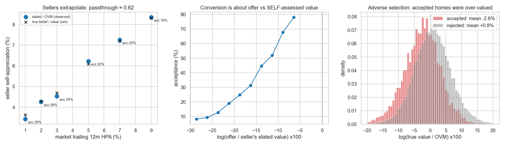

## 4. Worked examples

**Seller side, offer 3% higher:** true acceptance 23.0% → 32.0%. Linear causal estimate: -2.66 pp per pp of spread (truth -3.00).

**Buyer side, list 3% lower (per bought home):**

| planner       |   P(sold<=60d) now |   P(sold<=60d) at -3% |   Δ P60 (pp) |   E[DOM] now |   E[DOM] at -3% |   Δ revenue ($) |   Δ holding cost ($) |   Δ contribution ($/home) |
|:--------------|-------------------:|----------------------:|-------------:|-------------:|----------------:|----------------:|---------------------:|--------------------------:|
| causal (2SLS) |               0.65 |                  0.78 |        13.26 |        63.16 |           42.07 |        -4622.58 |             -1471.78 |                  -3035.24 |
| naive (OLS)   |               0.67 |                  0.67 |         0.32 |        56.36 |           55.89 |        -7638.25 |               -33.3  |                  -7414    |
| truth         |               0.71 |                  0.83 |        12.1  |        53.74 |           37.29 |        -4650.44 |             -1160.85 |                  -3373.33 |

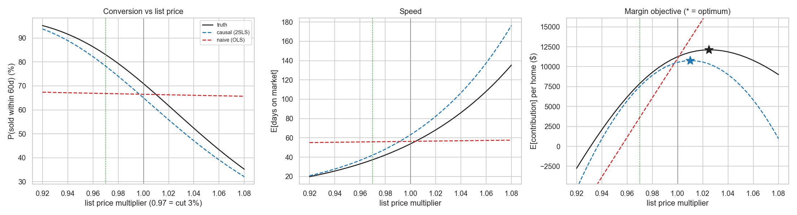

## 5. Optimization

### Seller side: spread change that maximizes E[contribution] per offer
| planner                                   |   delta_star_pp |   believed_contribution |   true_contribution |   true_accept_rate |   regret_vs_truth_opt |
|:------------------------------------------|----------------:|------------------------:|--------------------:|-------------------:|----------------------:|
| truth                                     |            3.00 |                 3026.39 |             3026.39 |               0.15 |                  0.00 |
| causal (CF logit + winner's curse)        |            3.50 |                 3189.70 |             3020.43 |               0.14 |                  5.96 |
| causal acceptance, ignores winner's curse |            3.75 |                 3291.31 |             3011.04 |               0.13 |                 15.35 |
| naive (confounded logit)                  |            6.00 |                 6467.32 |             2783.15 |               0.09 |                243.24 |

Winner's-curse slope c = -0.061 (se 0.073): each extra point of spread adds only (1 + c) points of margin on the accepted pool.

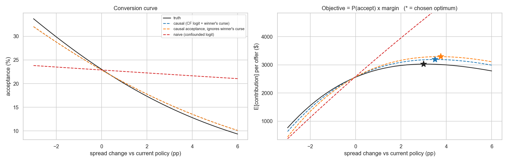

### Buyer side: list-price multiplier that maximizes E[contribution] per home
| planner       |   rho_star |   believed_contribution |   true_contribution |   true_p_sold_60d |   regret_vs_truth_opt |
|:--------------|-----------:|------------------------:|--------------------:|------------------:|----------------------:|
| truth         |      1.025 |               12112.680 |           12112.680 |             0.594 |                 0.000 |
| causal (2SLS) |      1.010 |               10761.668 |           11802.217 |             0.664 |               310.463 |
| naive (OLS)   |      1.080 |               30610.531 |            9004.354 |             0.352 |              3108.327 |

θ̂ = 13.34 (se 1.11; truth 12.0),  naive θ̂ = 0.28. Robust optimum under (θ, η) uncertainty: 1.010; 90% of draws in [1.002, 1.015].

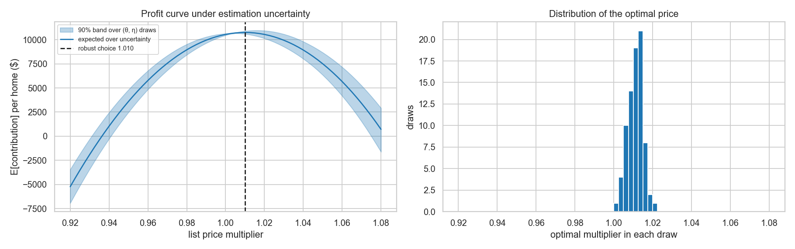

### Volume target (+30% acquisitions vs margin-maximizing policy)

Shadow price needed: λ ≈ $8,000 of margin per extra acquisition. Segment-specific spreads (true): volume 0.191/offer, contribution $2,974/offer. Chosen spread changes (pp): high_q0: +2.00, high_q1: +2.25, low_q0: +1.25, low_q1: +1.25, medium_q0: +1.00, medium_q1: +0.75

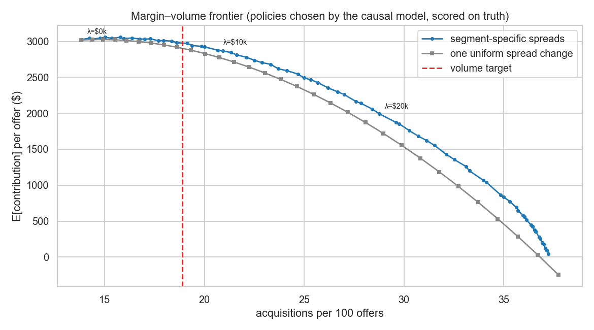